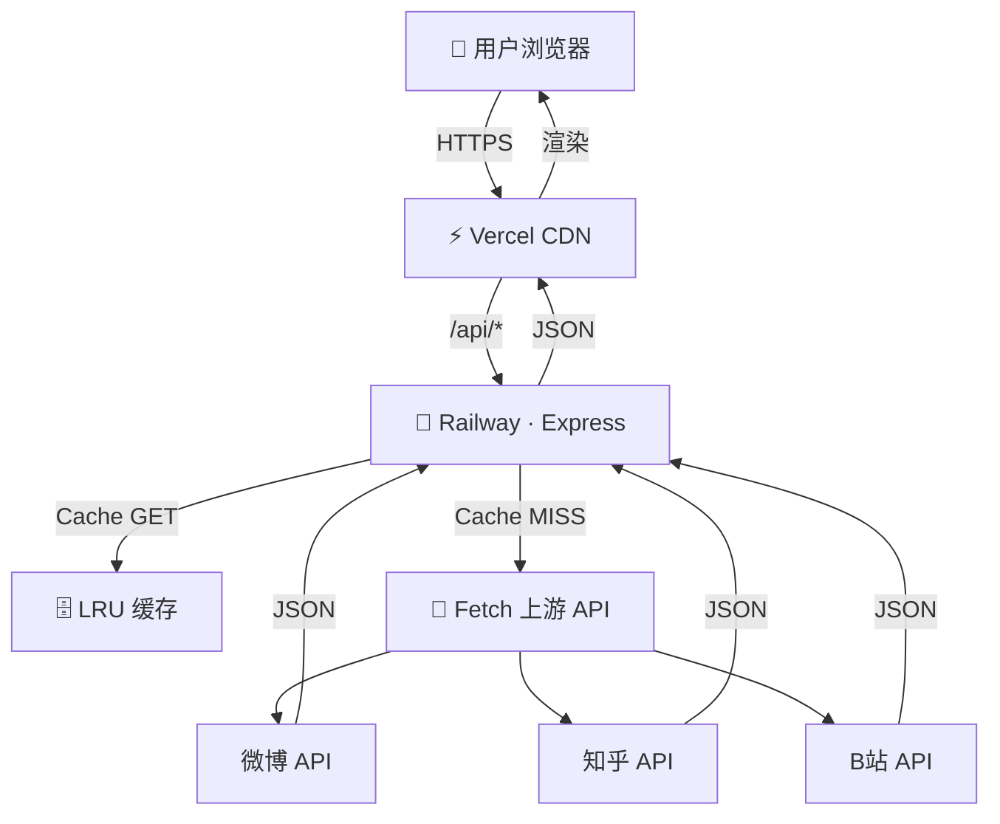

# 🏗️ 今日热搜 · 技术设计文档（TECH_DESIGN）

> **文档版本**：v1.0
> **创建日期**：2025-06-11
> **关联文档**：[RESEARCH.md](./RESEARCH.md) | [PRD.md](./PRD.md)

---

## ⚙️ 一、技术栈全景

| 层级 | 技术选型 | 说明 |
|---|---|---|
| 前端框架 | React 18 + TypeScript | 类型安全，组件化开发 |
| 构建工具 | Vite 5 | 极速开发服务器 + 生产构建 |
| 样式方案 | Tailwind CSS + CSS Modules | 原子类快速布局 + 局部样式隔离 |
| 状态管理 | React Query / SWR | 数据 fetching + 缓存 + 自动刷新 |
| 后端框架 | Node.js 18 + Express 5 | 轻量 HTTP 服务 |
| HTTP 客户端 | node-fetch / axios | 上游接口调用 |
| 缓存层 | LRU Cache（Map + TTL） | MVP 轻量方案，可平滑升级 Redis |
| 部署 | Vercel（前端）+ Railway（后端） | 免费额度 · 自动 HTTPS · CI/CD |

---

## 📁 二、项目结构

```
mini-hot-hub/
├── client/                          # 前端（Vite + React）
│   ├── src/
│   │   ├── components/
│   │   │   ├── HotCard/             # 热榜卡片（平台独立）
│   │   │   │   ├── index.tsx
│   │   │   │   ├── HotCard.module.css
│   │   │   │   └── Skeleton.tsx    # 骨架屏
│   │   │   ├── Layout/             # 全局布局（Header + Footer）
│   │   │   │   ├── index.tsx
│   │   │   │   └── Layout.module.css
│   │   │   └── RankBadge.tsx       # 排名徽章（TOP1/2/3 高亮）
│   │   ├── hooks/
│   │   │   ├── useHotList.ts       # 封装 useQuery 拉取热榜
│   │   │   └── useTimeAgo.ts       # 相对时间格式化
│   │   ├── api/
│   │   │   └── client.ts           # 统一 API 调用层
│   │   ├── types/
│   │   │   ├── hot.ts              # HotItem / HotPlatform 类型
│   │   │   └── api.ts              # API 响应通用类型
│   │   ├── mock/
│   │   │   └── hotMock.ts          # 开发阶段 Mock 数据
│   │   ├── App.tsx
│   │   ├── main.tsx
│   │   └── index.css               # 全局样式重置
│   ├── public/
│   │   └── favicon.svg
│   ├── vite.config.ts
│   ├── tsconfig.json
│   └── package.json
│
├── server/                          # 后端（Express）
│   ├── src/
│   │   ├── routes/
│   │   │   └── hot.ts              # GET /api/hot 系列接口
│   │   ├── services/
│   │   │   ├── weibo.ts            # 微博热搜解析
│   │   │   ├── zhihu.ts            # 知乎热榜解析
│   │   │   ├── bilibili.ts         # B站热搜解析
│   │   │   └── platform.ts         # 平台注册表 + 统一入口
│   │   ├── utils/
│   │   │   ├── cache.ts            # LRU 缓存封装
│   │   │   ├── fetcher.ts          # 带超时 + 重试的 fetch 封装
│   │   │   └── time.ts             # 时间工具函数
│   │   └── index.ts                # 入口文件
│   ├── .env
│   ├── tsconfig.json
│   └── package.json
│
├── docs/
│   ├── RESEARCH.md
│   ├── PRD.md
│   ├── TECH_DESIGN.md
│   └── AGENTS.md
└── README.md
```

---

## 📊 三、数据模型

### 3.1 HotItem（单条热搜）

```typescript
interface HotItem {
  rank: number;        // 排名（1-based）
  title: string;       // 热搜标题
  url: string;         // 跳转链接（原文地址）
  heat?: string;       // 热度值（如 "520万", "1.2亿"）
  extra?: Record<string, any>; // 平台扩展字段
}
```

### 3.2 HotPlatform（单平台响应）

```typescript
interface HotPlatform {
  source: string;       // 平台标识：weibo | zhihu | bilibili
  sourceName: string;   // 平台中文名
  listName: string;     // 榜单名称（如"微博热搜榜"）
  updatedAt: string;    // ISO 8601 时间戳
  items: HotItem[];     // 热搜列表
  error?: boolean;     // 是否异常
  message?: string;    // 异常提示（仅 error=true 时存在）
  fromCache?: boolean;  // 是否来自缓存
}
```

### 3.3 API 聚合响应（GET /api/hot）

```typescript
interface HotAggregateResponse {
  success: boolean;
  data: {
    weibo?: HotPlatform;
    zhihu?: HotPlatform;
    bilibili?: HotPlatform;
  };
  timestamp: string;
}
```

---

## 🔌 四、接口设计

### 4.1 GET /api/hot/:source

| 参数 | 类型 | 必填 | 说明 |
|---|---|---|---|
| `source` | string | ✅ | 平台标识（weibo / zhihu / bilibili） |

**成功响应（200）**

```json
{
  "source": "weibo",
  "sourceName": "微博",
  "listName": "微博热搜榜",
  "updatedAt": "2025-06-11T10:30:00Z",
  "fromCache": false,
  "items": [
    { "rank": 1, "title": "某热点事件持续发酵", "url": "https://...", "heat": "532万" },
    { "rank": 2, "title": "另一热点话题上榜", "url": "https://...", "heat": "218万" }
  ]
}
```

**失败响应（200 + error flag）**

```json
{
  "source": "weibo",
  "sourceName": "微博",
  "listName": "微博热搜榜",
  "updatedAt": "2025-06-11T10:30:00Z",
  "error": true,
  "message": "上游接口超时，请稍后重试",
  "items": []
}
```

### 4.2 GET /api/hot

一次性返回全部平台数据。任意平台失败不影响其他平台结果。

---

## 🔄 五、核心业务流程

```
┌──────────┐     fetch      ┌──────────────┐     fetch      ┌──────────────┐
│  浏览器   │ ──────────→   │  Express 后端  │ ──────────→   │  上游平台 API  │
│  React    │ ←──────────   │  /api/hot/:s  │ ←──────────   │  (微博/知乎/B站)│
└──────────┘    JSON       └──────────────┘    JSON        └──────────────┘
                        │
                        ▼
                 ┌──────────────┐
                 │  LRU 缓存层   │
                 │  Map + TTL   │
                 └──────────────┘
```

**详细时序**：

1. 用户打开首页 → 前端 `useQuery` 触发 GET `/api/hot`
2. 后端收到请求 → 查缓存（key = `source:weibo` 等）
3. **缓存命中** → 直接返回缓存数据，Header 标记 `X-Cache: HIT`
4. **缓存未命中** → `fetcher.ts` 带超时（5s）请求上游 JSON
5. 上游响应 → 解析为 `HotPlatform` 结构 → 写入缓存（TTL 600s）→ 返回前端
6. 前端按平台渲染 `HotCard`，失败则渲染 Error 态

---

## 🧠 六、缓存策略

| 策略 | 实现 |
|---|---|
| 缓存类型 | 内存 LRU Map（key = `${source}:hot`） |
| TTL | 默认 600 秒（可通过环境变量 `CACHE_TTL` 覆盖） |
| 缓存预热 | 后端启动后 30s 内主动 fetch 各平台一次 |
| 缓存失效 | TTL 过期自动清除；手动清理接口 `DELETE /api/cache/:source`（仅开发环境） |
| 缓存穿透防护 | 上游失败时仍写入「空结果缓存」（TTL 缩短至 60s），防止雪崩 |

---

## 🛡️ 七、异常处理矩阵

| 场景 | 检测方式 | 处理方式 | 用户感知 |
|---|---|---|---|
| 上游超时（>5s） | fetch timeout | 返回 error 态 + message | 卡片显示「加载超时」 |
| 上游 4xx/5xx | HTTP 状态码 | 返回 error 态 | 卡片显示「服务暂不可用」 |
| 上游返回空列表 | items.length === 0 | 返回 success + 空数组 | 卡片显示「暂无数据」 |
| 全部平台同时失败 | 遍历结果 | 展示全局 Fallback 页 | 全页显示「系统维护中」 |
| 前端网络断开 | fetch 抛错 | React Query error 态 | 页面顶部 Toast 提示 |

---

## 🔧 八、开发环境配置

### 8.1 Vite 代理

```typescript
// vite.config.ts
export default defineConfig({
  server: {
    proxy: {
      '/api': {
        target: 'http://localhost:3001',
        changeOrigin: true,
      },
    },
  },
});
```

### 8.2 环境变量

| 变量 | 用途 | 默认值 |
|---|---|---|
| `PORT` | 后端监听端口 | 3001 |
| `CACHE_TTL` | 缓存秒数 | 600 |
| `FETCH_TIMEOUT` | 上游请求超时（ms） | 5000 |
| `VITE_API_BASE` | 前端 API 基地址（生产） | 自动 fallback 到 `/api` |

---

## 🚀 九、部署架构

```
用户浏览器
    │
    ▼
┌─────────────┐         ┌─────────────┐
│  Vercel CDN  │ ──→    │  Railway    │
│  (前端静态)  │   API   │  (Express)  │
└─────────────┘         └─────────────┘
                              │
                              ▼
                        各平台上游 API
```

- **前端**：Vercel 自动部署 `client/` 目录，每次 push 触发构建
- **后端**：Railway 连接 GitHub，自动部署 `server/` 目录
- **跨域**：生产环境使用 `VITE_API_BASE` 指向 Railway 域名；或 Railway 同域反代

---

## 📐 十、架构图（Mermaid）



---

## 💡 十一、打卡思考

### Q：为什么需要后端？（一句话解释）

> **浏览器受同源策略（CORS）限制，无法直接跨域抓取微博/知乎/B站的接口数据；后端充当「数据中转站」，同时承担缓存、容错、聚合的职责，是前后端分离架构下的必然选择。**

更展开地说：

1. **CORS 是硬约束**：浏览器的安全模型禁止前端直接请求第三方域名（微博 API 不会给你加 `Access-Control-Allow-Origin`），后端没有这个限制。
2. **缓存必须服务端做**：如果在前端缓存，每个用户的浏览器独立缓存，无法共享；服务端缓存可以让所有用户共享同一份数据，大幅降低上游请求量。
3. **容错与数据清洗**：各平台返回的数据格式不同，后端统一为 `HotPlatform` 结构，前端无需关心差异。
4. **未来扩展**：后续加鉴权、限流、数据统计，都是在后端做最自然。
